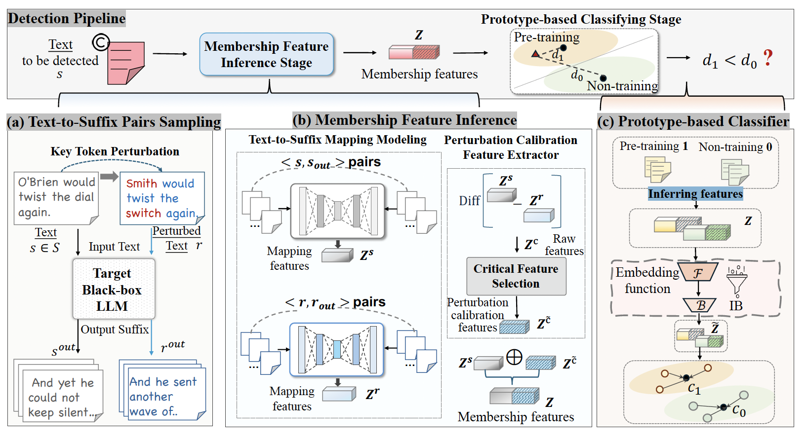

<div align="center">
<h1>Automated Detection of Pre-training Text in Black-box LLMs</h1>
</div>

# 🔍VeilProbe

> This is the code for the paper.
>
> We propose the VeilProbe framework to automatically detect LLMs' pre-training texts in a black-box setting without human intervention. 
>
<div align="center">

</div>


It consists of three modules: 
 (a) The text-to-suffix sampling module generates text-to-suffix pairs; (b) The membership feature inference module infers membership features with a sequence-to-sequence model based on the above pairs; (c) The prototype-based classifier is trained based on the features from ground-truth samples, and then the pre-training and non-training prototypes are constructed. The first two modules prepare the membership feature inference stage for the texts to be detected, and the third one trains a membership classifier for detection.


## 💻 Reproduce our work


To reproduce results, you'll need to first run the following command to generate the prefix-suffix pairs and perturbed prefix-suffix pairs.
>
> ```python
> python sampling_close_sourced_LLM.py #obtaining generated pairs
> python mappingmodel.py #obtaining mapping model
> ```

> To obtain the perturbed version, run 
>
> ```python
> keyperturb_agg.py
> ```
>
>  under the key_perturb directory.

> The trained mapping model and the perturbed mapping model can be obtained by mappingmodel.py above mentioned
>
>  Finally, run the following command. 

```python
python run_protonet_classifier.py
```

## Citation
